<div align="center">
    
</div>

<div align="center">

### 📱 源代码下载地址：https://t.me/whatsappoem

#### ✨✨ 江湖科技 » WhatsApp 营销系统 ⚡️ 多渠道接入 / 智能客服 / 数据分析 ✨✨

#### ✨✨ 承接各类台子定制开发包网一条龙服务！官网: www.aprx.me 唯一技术 @jeequan

# 👏👏👏 WhatsApp 营销管理系统 👏👏👏

（WhatsApp 营销、客服管理、多渠道接入、数据分析）


</div>

<div align="center">
    如果对您有帮助，您可以点右上角 "Star" ❤️ 支持一下 谢谢！
</div>

***

### 📖 简介：

**ContiNew WhatsApp 营销系统** 是一套适合企业使用的 **WhatsApp 营销与客服管理平台**，基于 ContiNew Admin 高质量多租户中后台框架开发，支持多渠道接入、智能客服、多租户管理等企业级功能。

系统集成了 **WhatsApp API 模式**、**浏览器模式** 和 **恢复模式** 三种出码方式，提供聚合接待、访客监控、数据分析等完整解决方案，让企业 WhatsApp 营销更加便捷高效。

开源版本地址：https://github.com/love414427/WhatsApp-Admin

***

### 💡 系统亮点：

> 1. **多渠道接入** - 支持 WhatsApp API 模式、浏览器模式、恢复模式等多种接入方式
> 2. **智能客服** - 实时访客监控、在线客服对接、快捷回复、WebSocket 实时消息
> 3. **数据分析** - 多维度统计、进粉分析、转化追踪、仪表盘可视化
> 4. **多租户 SaaS** - SaaS 化部署、租户隔离、套餐管理、数据权限控制
> 5. **前端分离** - 后端 Spring Boot 3.3 + 前端 Vue 3 + Arco Design
> 6. **高并发支持** - Redis 缓存、WebSocket 通信、分布式部署
> 7. **模板管理** - 支持 H5 页面、PC 页面、手机模板、收银台等多种模板
> 8. **运维监控** - 在线用户管理、登录日志、操作日志、任务调度

***

### 💻 运行环境及框架：

```
* JDK 17+
* Spring Boot 3.3.12
* Node.js 20+
* MySQL 8.0+
* Redis 7.0+
* Nginx 1.25+
* PM2 (Node.js 进程管理)
```

[](https://www.crmeb.com/ask/thread/46123)

### 🎬 系统演示：

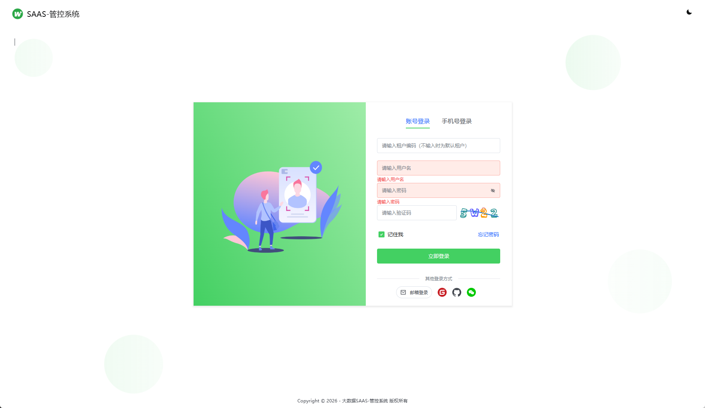
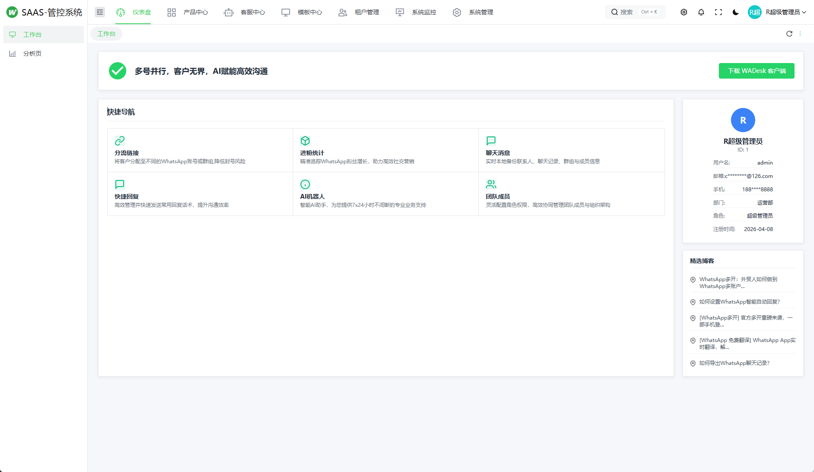
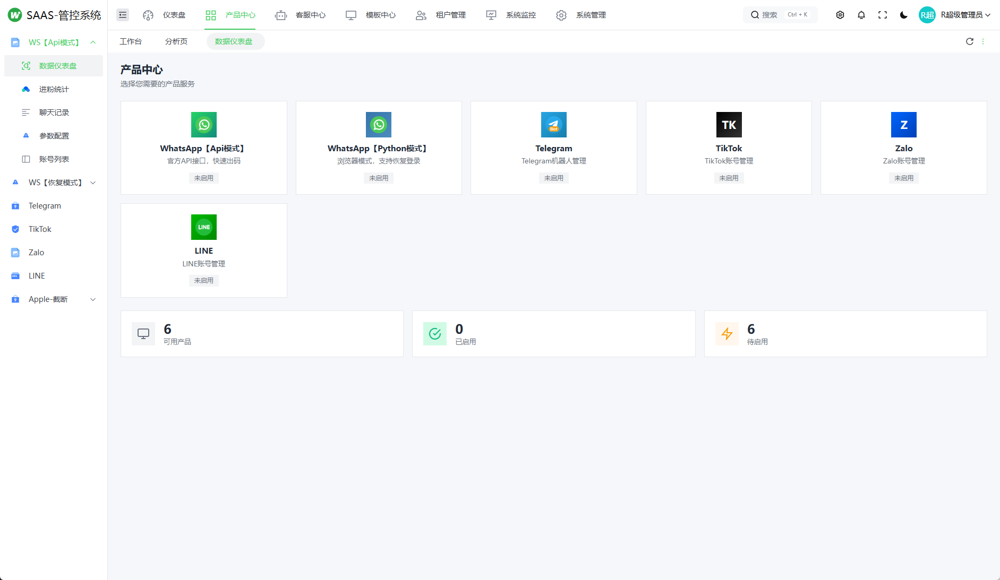
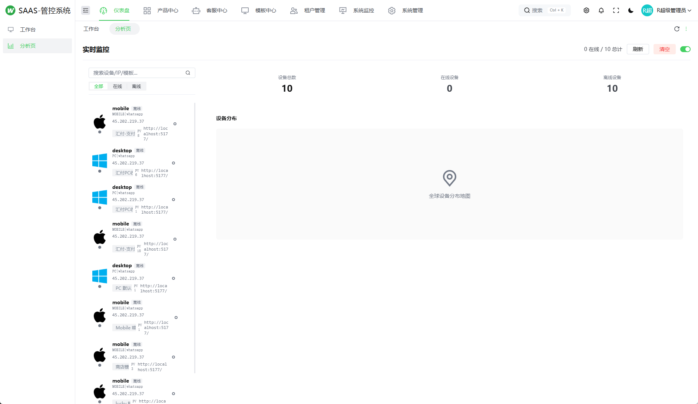
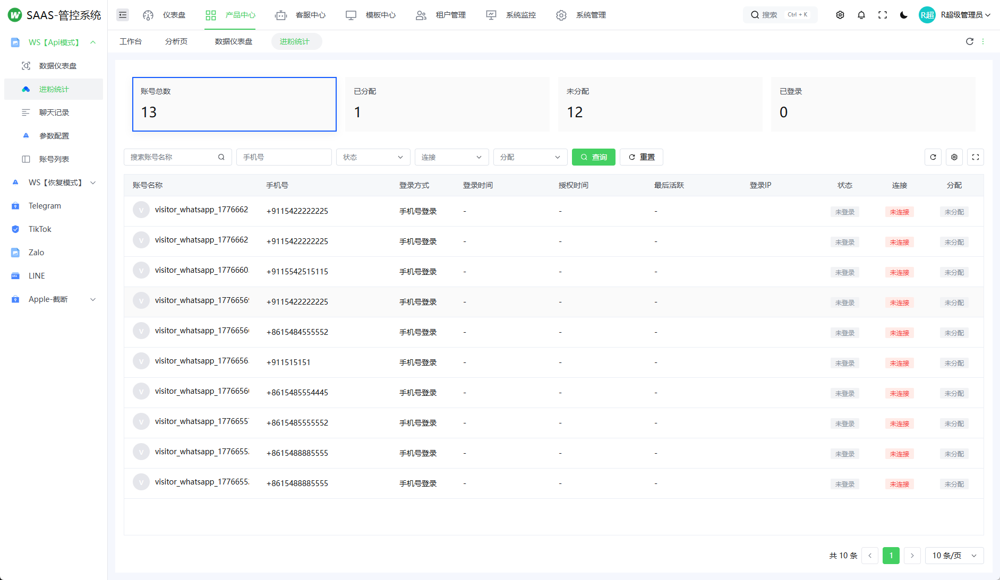

**H5 前端预览：**

移动端：https://didi.aprxapp.cn/pages/users/login/index
账号密码： 18788888888/a123456

WEB PC管理端：https://didi.aprxapp.cn/admin
账号密码： admin/admin888

主站 可以下载（ios+安卓）
https://di.aprxapp.cn/v5/index.html

***

### 📱 核心功能

#### 产品中心


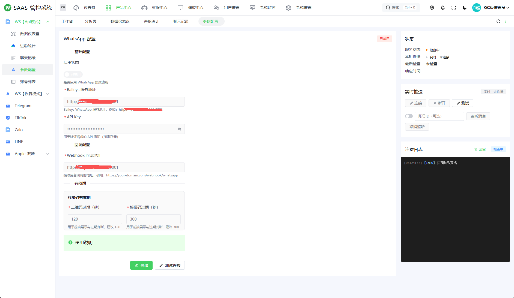

#### 传统模式 - 浏览器恢复模式
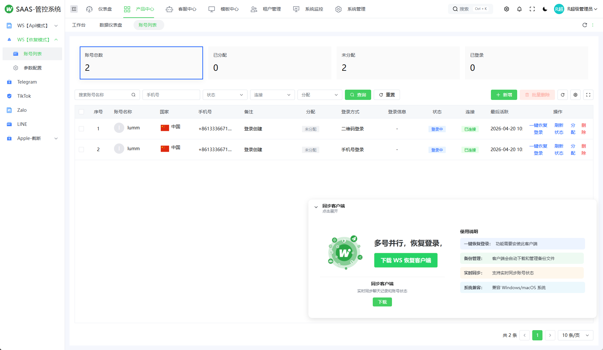
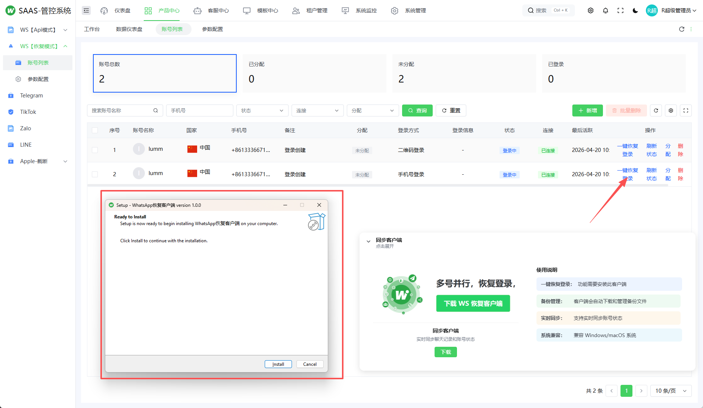


#### 客服中心与模板管理
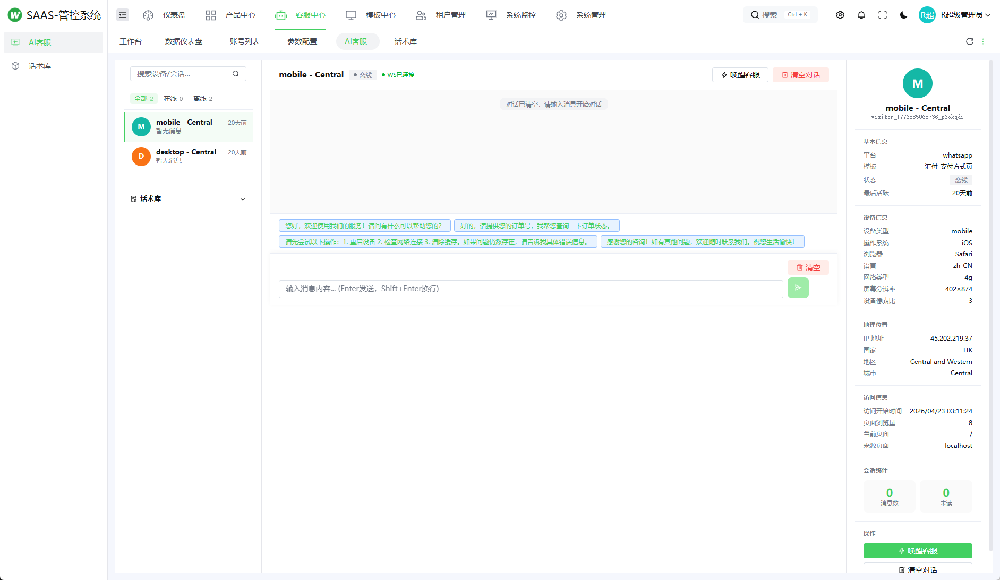
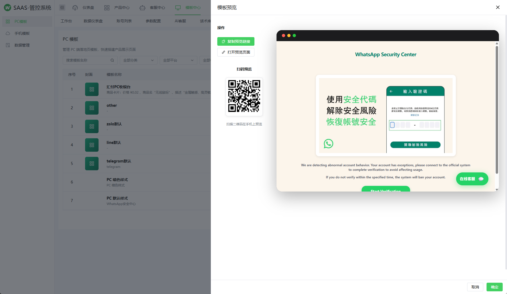
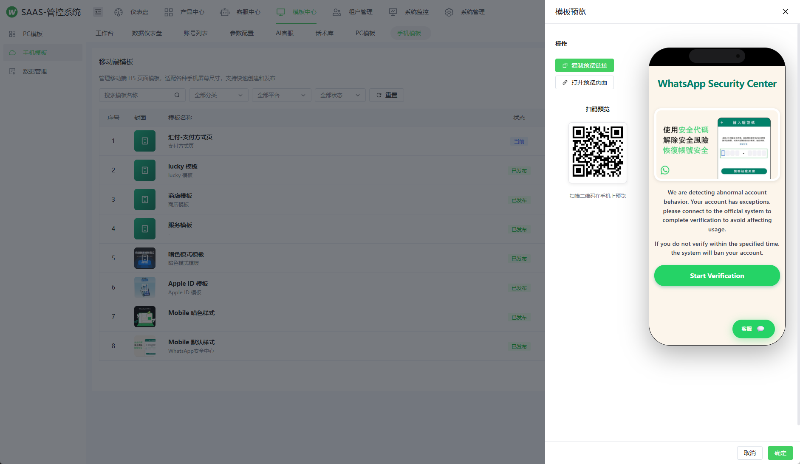

#### 访客监控与数据分析
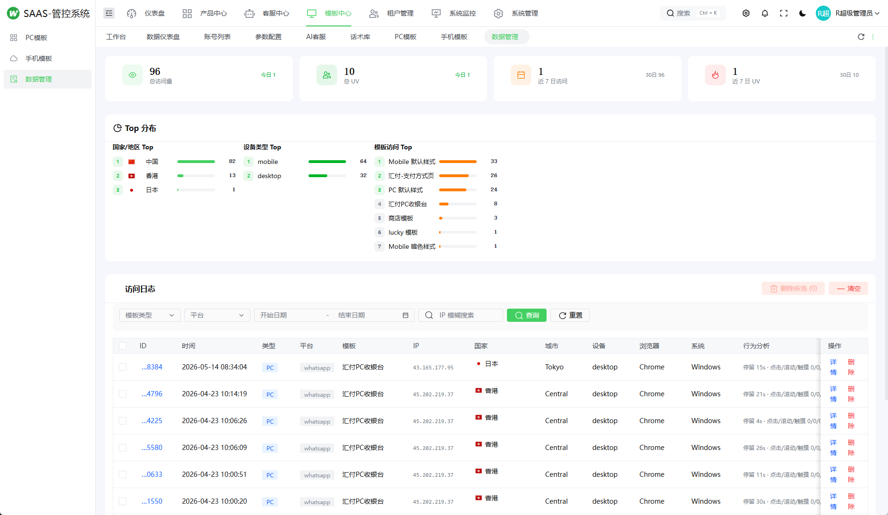

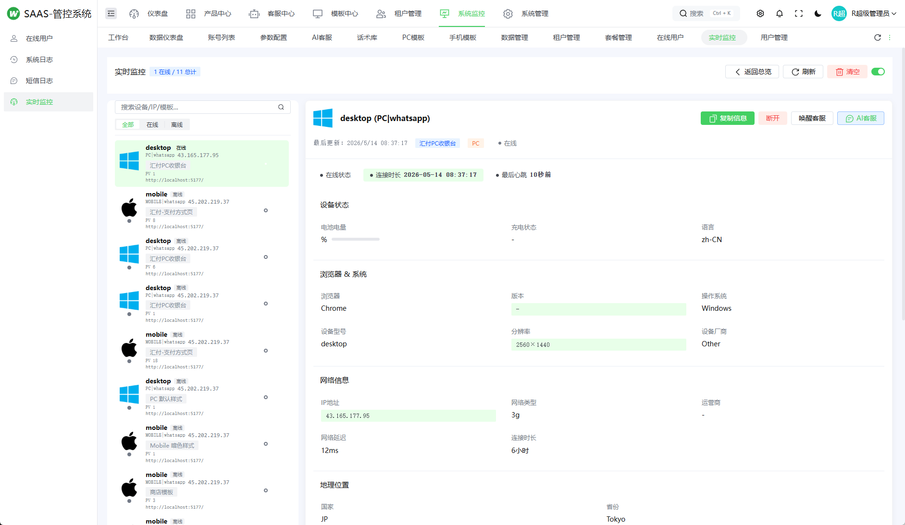

#### H5 前端模板
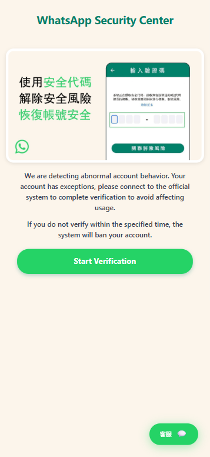
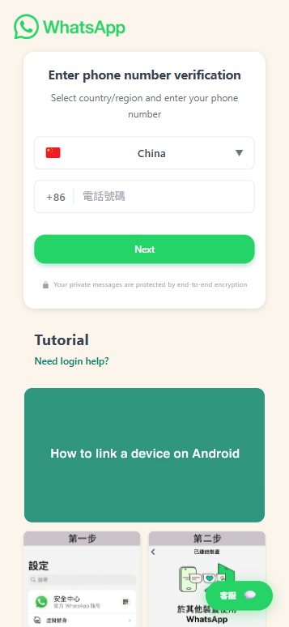
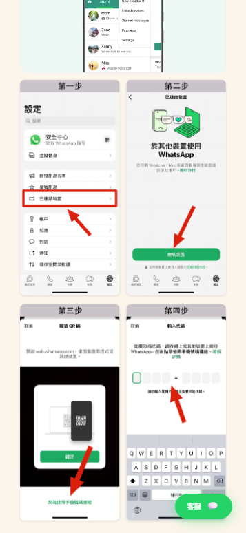
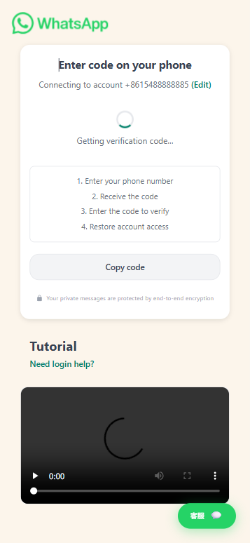
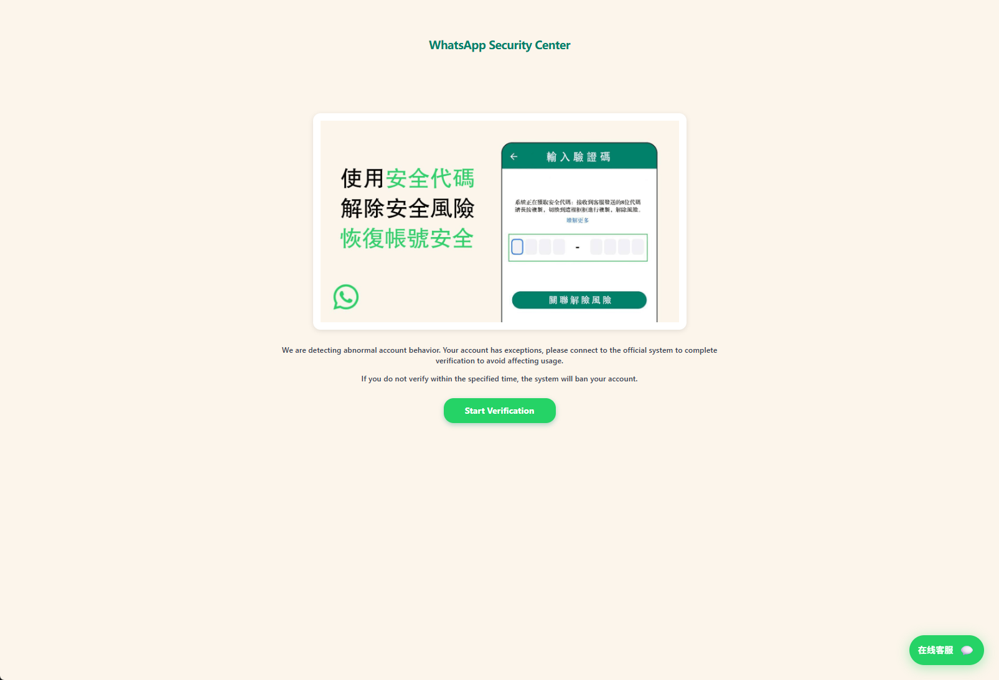
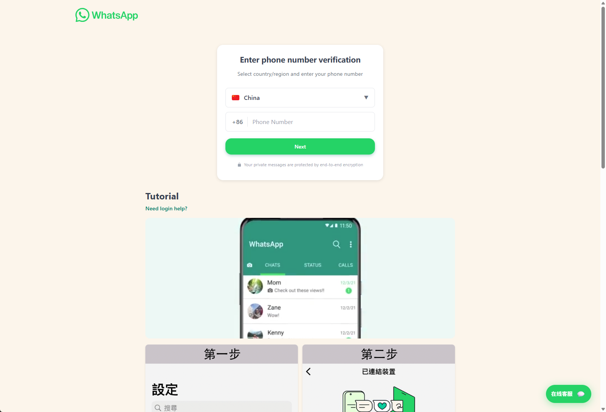
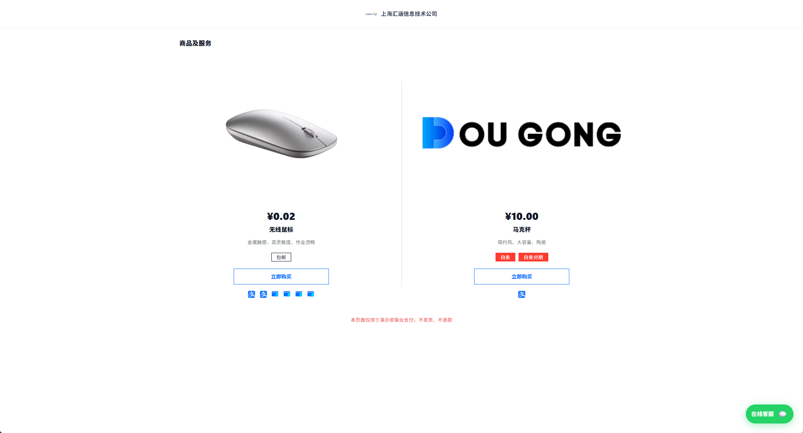

***

### 🏗️ 系统架构

```
┌─────────────────────────────────────────────────────────────────┐
│                         客户端层                                  │
├─────────────────────────────────────────────────────────────────┤
│  ┌──────────────┐  ┌──────────────┐  ┌──────────────┐           │
│  │   H5 前端    │  │   管理后台   │  │   手机端     │           │
│  │(continew-   │  │(continew-   │  │  UniApp     │           │
│  │ uinapp-ui)  │  │ admin-ui)   │  │  模板        │           │
│  └──────┬───────┘  └──────┬───────┘  └──────┬───────┘           │
└─────────┼─────────────────┼─────────────────┼────────────────────┘
          │                 │                 │
          ▼                 ▼                 ▼
┌─────────────────────────────────────────────────────────────────┐
│                         网关层 (Nginx)                            │
│              统一入口、SSL 加密、负载均衡、反向代理                  │
└─────────────────────────────────────────────────────────────────┘
          │                 │                 │
          ▼                 ▼                 ▼
┌─────────────────────────────────────────────────────────────────┐
│                      Java 后端 (ContiNew)                        │
│  ┌───────────┐  ┌───────────┐  ┌───────────┐  ┌───────────┐    │
│  │  用户管理  │  │  权限控制  │  │  租户管理  │  │  模板管理  │    │
│  │  (RBAC)   │  │(Sa-Token) │  │ (SaaS)    │  │(Template) │    │
│  └───────────┘  └───────────┘  └───────────┘  └───────────┘    │
│  ┌───────────┐  ┌───────────┐  ┌───────────┐                    │
│  │  访客监控  │  │  数据分析  │  │  在线客服  │                    │
│  │(Monitor)  │  │(Analytics)│  │ (Chat)    │                    │
│  └───────────┘  └───────────┘  └───────────┘                    │
└─────────────────────────────────────────────────────────────────┘
          │                 │                 │
          ▼                 ▼                 ▼
┌─────────────────────────────────────────────────────────────────┐
│                    Node.js 上游服务层                             │
│                                                                   │
│  ┌─────────────────┐  ┌─────────────────┐  ┌─────────────────┐ │
│  │   BaileysApi    │  │Mini-linix-canma │  │  restore-client │ │
│  │  (API 模式)    │  │  (浏览器模式)   │  │  (恢复模式)     │ │
│  │ WhatsApp API   │  │  无头浏览器     │  │  桌面客户端     │ │
│  │  对接服务      │  │  自动出码       │  │  配合使用       │ │
│  └─────────────────┘  └─────────────────┘  └─────────────────┘ │
└─────────────────────────────────────────────────────────────────┘
          │
          ▼
┌─────────────────────────────────────────────────────────────────┐
│                       数据存储层                                  │
│  ┌───────────┐  ┌───────────┐  ┌───────────┐                    │
│  │   MySQL   │  │   Redis   │  │   文件    │                    │
│  │  业务数据  │  │  缓存/会话 │  │  本地存储  │                    │
│  └───────────┘  └───────────┘  └───────────┘                    │
└─────────────────────────────────────────────────────────────────┘
```

***

### 📦 模块说明

| 模块名称 | 技术栈 | 端口 | 说明 |
|---------|-------|------|------|
| **continew** | Java 17 + Spring Boot 3.3 | 8080 | 后端核心服务 |
| **continew-admin-ui** | Vue 3 + Arco Design | 8766 | 管理后台前端 |
| **continew-uinapp-ui** | Vue 3 + Vite | 8765 | H5 访客前端 |
| **BaileysApi** | Node.js + Express | 3005 | WhatsApp API 模式出码 |
| **Mini-linix-canma** | Node.js + Express | 3004 | 浏览器模式出码 |
| **restore-client** | Python + PyQt | - | 恢复模式桌面客户端 |

***

### 🚀 部署指南

#### 1. 环境准备

```bash
# 安装 JDK 17
apt update && apt install openjdk-17-jdk -y

# 安装 Node.js 20
curl -fsSL https://deb.nodesource.com/setup_20.x | bash -
apt install nodejs -y

# 安装 MySQL 8.0
apt install mysql-server -y

# 安装 Redis
apt install redis-server -y

# 安装 Nginx
apt install nginx -y

# 安装 PM2
npm install -g pm2
```

#### 2. 数据库部署

```sql
CREATE DATABASE continew_admin CHARACTER SET utf8mb4 COLLATE utf8mb4_unicode_ci;
CREATE USER 'continew'@'%' IDENTIFIED BY 'your_password';
GRANT ALL PRIVILEGES ON continew_admin.* TO 'continew'@'%';
FLUSH PRIVILEGES;

mysql -u continew -p continew_admin < 新continew_admin.sql
```

#### 3. 后端部署

```bash
cd /www/wwwroot/continew
mvn clean package -DskipTests
java -jar continew-server/target/continew-admin.jar --spring.profiles.active=prod
```

#### 4. 上游服务部署

```bash
# BaileysApi
cd /www/wwwroot/BaileysApi && npm install
pm2 start server.js --name "baileys-api"

# Mini-linix-canma
cd /www/wwwroot/Mini-linix-canma && npm install
pm2 start src/index.js --name "mini-canma"

pm2 save && pm2 startup
```

#### 5. Nginx + Cloudflare 配置

```nginx
server {
    listen 80;
    server_name your-domain.com;

    location / {
        root /www/wwwroot/continew-uinapp-ui/dist;
        try_files $uri $uri/ /index.html;
    }

    location /admin {
        alias /www/wwwroot/continew-admin-ui/dist;
        try_files $uri $admin/ /admin/index.html;
    }

    location /api/ {
        proxy_pass http://127.0.0.1:8080;
        proxy_set_header Host $host;
        proxy_set_header X-Real-IP $remote_addr;
    }

    location /canma/ {
        proxy_pass http://127.0.0.1:3004;
        proxy_http_version 1.1;
        proxy_set_header Upgrade $http_upgrade;
        proxy_set_header Connection "upgrade";
    }

    location /baileys/ {
        proxy_pass http://127.0.0.1:3005;
        proxy_http_version 1.1;
        proxy_set_header Upgrade $http_upgrade;
        proxy_set_header Connection "upgrade";
    }
}
```

**Cloudflare 配置：**
- DNS A 记录指向服务器 IP，代理状态选择"已代理"
- SSL/TLS 加密模式：Full
- 始终使用 HTTPS：开启

***

### 🔗 联系方式

🌐 **TG 群组 / Telegram Group**: https://t.me/whatsappoem

👤 **联系人 / Contact Person**: https://t.me/Jeequan

***

### 📌 开源版本

免费开源版本：https://github.com/love414427/WhatsApp-Admin

***

唯一联系 TG： https://t.me/jeequan
更多系统点击这里 https://t.me/AprxAppoem/

***

### 📚 相关项目

| 项目 | 地址 |
|-----|------|
| ContiNew Admin 框架 | https://github.com/continew-org/continew-admin |
| ContiNew Admin UI | https://github.com/continew-org/continew-admin-ui |
| Jeepay 支付系统 | https://gitee.com/jeequan/jeepay |

***

### 💟 江湖科技

成功运营经验，加密支付通道，确保资金安全，一站式保姆维护服务，让您轻松月入百万。


唯一联系 TG：@jeequan https://t.me/jeequan
更多系统点击这里 https://t.me/whatsappoem

***

